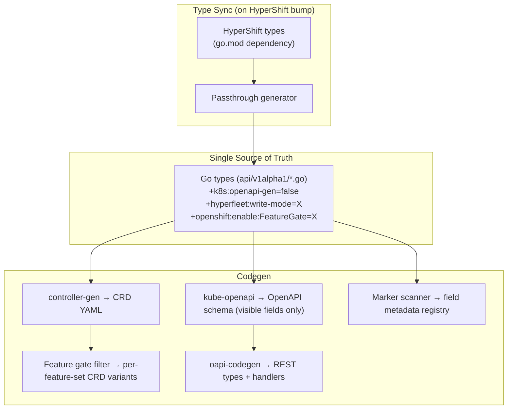

# API Management: HyperShift CRD to Platform API OpenAPI

**Last Updated Date**: 2026-06-27

## Summary

There are three layers of types:

- **HyperShift CRDs**: The full HostedCluster and NodePool, owned by the HyperShift team.
- **HyperFleet CRDs**: Some wrap HyperShift types (Cluster wraps HostedCluster, NodePool wraps NodePool); others are HyperFleet-native with no upstream equivalent.
- **Platform API**: A REST API whose OpenAPI spec is generated from the HyperFleet CRD types.

For each CRD, a single set of Go types is the source of truth for both the CRD schema and the customer-facing OpenAPI schema. Go markers on these types control visibility, write modes, and feature gating. Codegen reads these markers and produces all downstream artifacts (CRDs, OpenAPI spec, field metadata registry).

This document uses Cluster as the detailed example; the same patterns apply to NodePool and any future resource types.

## Boundary 1: HyperShift CRD → HyperFleet CRD

This boundary applies to wrapper CRDs only (Cluster wraps HostedCluster, NodePool wraps NodePool). HyperFleet-native CRDs skip this boundary entirely.

### Mechanism

We cannot add Go markers to types imported from another module. So instead of embedding HyperShift types directly, a **code generator** reads the upstream HyperShift types and produces HyperFleet-owned Go structs that mirror all of their fields. These are called **passthrough types**.

Each wrapper CRD separates **envelope fields** (platform-managed, not passed to HyperShift) from the **passthrough struct** (generated mirror of all upstream fields):

```go
type ClusterSpec struct {
    // Envelope fields (HyperFleet-only, not passed to HyperShift)
    DeleteProtection    *DeleteProtection   `json:"deleteProtection,omitempty"`
    ExpirationTimestamp *metav1.Time        `json:"expirationTimestamp,omitempty"`
    Properties          map[string]string   `json:"properties,omitempty"`

    // All upstream HostedCluster fields, generated
    // +kubebuilder:validation:Required
    HostedCluster HostedClusterPassthrough `json:"hostedCluster"`
}
```

**Conversion functions** map between HyperFleet and HyperShift types:

```go
func ToHyperShiftHostedCluster(cluster *v1alpha1.Cluster) *hypershiftv1beta1.HostedCluster { ... }
func FromHyperShiftHostedCluster(hc *hypershiftv1beta1.HostedCluster) v1alpha1.ClusterStatus { ... }

func ToHyperShiftNodePool(np *v1alpha1.NodePool) *hypershiftv1beta1.NodePool { ... }
func FromHyperShiftNodePool(np *hypershiftv1beta1.NodePool) v1alpha1.NodePoolStatus { ... }
```

### Type Synchronization

A code generator keeps the passthrough types in sync with upstream HyperShift:

1. **Bump** the HyperShift module in `go.mod`
2. **Run the generator** (`make generate-passthrough`), which reads upstream types and produces/updates the passthrough Go structs
3. **New upstream fields** appear with safe defaults: `+k8s:openapi-gen=false` (hidden) and `+hyperfleet:write-mode=service-set` (not customer-writable)
4. **Removed upstream fields** are dropped from the passthrough types
5. **Developer reviews** the diff, sets the appropriate boundary 2 markers on new fields, and runs `make manifests openapi`

CI verifies that every passthrough field has an explicit visibility and write-mode annotation.

## Boundary 2: HyperFleet CRD → Platform API OpenAPI

This boundary applies to **all** HyperFleet CRDs (wrappers and native). Three Go markers control what reaches the customer-facing API.

### Marker 1: Visibility (`+k8s:openapi-gen=false`)

Controls whether a field appears in the OpenAPI schema. This is a [built-in kube-openapi feature](https://github.com/kubernetes/kube-openapi/blob/master/pkg/generators/README.md).

```go
type ClusterSpec struct {
    // Visible: appears in both CRD and OpenAPI
    Name   string `json:"name"`

    // Hidden: appears in CRD only, absent from OpenAPI
    // +k8s:openapi-gen=false
    AccountID string `json:"accountId"`
}
```

Hidden fields are never seen by customers. The operator and internal tooling can read and write them freely.

### Marker 2: Write Mode (`+hyperfleet:write-mode=X`)

Controls whether customers can set or change a field.

```go
type ClusterSpec struct {
    // Customer sets on create, cannot change afterward
    // +hyperfleet:write-mode=immutable
    Region string `json:"region"`

    // Customer can change anytime
    // +hyperfleet:write-mode=mutable
    DeleteProtection *DeleteProtection `json:"deleteProtection,omitempty"`

    // Platform sets this, customer cannot
    // +k8s:openapi-gen=false
    // +hyperfleet:write-mode=service-set
    CreatorARN string `json:"creatorARN,omitempty"`
}
```

| Write Mode | On Create (POST) | On Update (PUT/PATCH) |
| ---------- | ----------------- | --------------------- |
| **mutable** | Customer can set | Customer can change |
| **immutable** | Customer can set | Rejected if changed |
| **service-set** | Platform fills it in | Rejected if present |

### Marker 3: Feature Gate (`+openshift:enable:FeatureGate=X`)

Controls per-customer field entitlements. Follows the [openshift/api pattern](https://github.com/openshift/api/tree/master/tools/codegen): gates are grouped into feature sets (Default, TechPreviewNoUpgrade, DevPreviewNoUpgrade), and the tooling generates one CRD variant per feature set.

```go
type HostedClusterPassthrough struct {
    // Available to all customers (GA, no gate)
    // +kubebuilder:validation:Required
    Release Release `json:"release"`

    // Only available to customers with this gate enabled
    // +openshift:enable:FeatureGate=HyperFleetEtcdConfig
    // +hyperfleet:write-mode=immutable
    // +optional
    Etcd *EtcdSpec `json:"etcd,omitempty"`
}
```

Feature gates are declared in a single registry file:

```go
var HyperFleetFeatureGates = map[string]FeatureGateInfo{
    "HyperFleetEtcdConfig":       {Stage: GA},
    "HyperFleetAutoScaling":      {Stage: TechPreview},
    "HyperFleetSecretEncryption": {Stage: TechPreview},
}
```

Promoting a gate (e.g., TechPreview → GA) is a one-line change followed by regeneration. Gated fields appear in the OpenAPI schema for all customers (gates are enforced on writes, not reads).

The Platform API resolves a customer's effective gates from two sources:

1. **Feature set assignment**: each account is assigned a feature set (Default, TechPreviewNoUpgrade, DevPreviewNoUpgrade). The hierarchy is inclusive: TechPreview grants all Default gates, DevPreview grants all TechPreview gates.
2. **Per-account entitlements**: an entitlement service can enable individual gates for specific accounts, independent of their feature set.

```go
func customerHasGate(customer Customer, gate string) bool {
    info := HyperFleetFeatureGates[gate]
    if info.Stage <= customer.FeatureSet {
        return true
    }
    return entitlements.HasGate(customer.AccountID, gate)
}
```

### Generation Pipeline



The goal is to adopt the [openshift/api codegen tooling](https://github.com/openshift/api/tree/master/tools/codegen) when it becomes reusable outside of openshift/api. Until then, a lightweight equivalent handles the passthrough generation and feature-set CRD variants.

### Runtime Enforcement

The marker scanner produces a **field metadata registry**: generated Go code mapping every field path to its write mode and feature gate. The Platform API imports this registry and uses it to validate every mutation generically, with no field-specific code.

```go
// Generated from markers. Platform API imports this.
var FieldRegistry = map[string]FieldMeta{
    "spec.name":                  {WriteMode: Immutable},
    "spec.region":                {WriteMode: Immutable},
    "spec.deleteProtection":      {WriteMode: Mutable},
    "spec.accountId":             {WriteMode: ServiceSet},
    "spec.hostedCluster.release": {WriteMode: Immutable},
    "spec.hostedCluster.etcd":    {WriteMode: Immutable, Gate: "HyperFleetEtcdConfig"},
    // ...
}
```

On every write request, the Platform API walks the fields in the request body and checks each one against this registry:

```go
for fieldPath, value := range req.Fields() {
    meta := FieldRegistry[fieldPath]

    if meta.Gate != "" && !customerHasGate(customer, meta.Gate) {
        // 400: field 'hostedCluster.etcd' requires gate 'HyperFleetEtcdConfig'
    }
    if meta.WriteMode == ServiceSet {
        // 400: field 'accountId' cannot be set by customers
    }
    if meta.WriteMode == Immutable && req.IsUpdate() && value != current.Get(fieldPath) {
        // 400: field 'region' is immutable
    }
}
```

After validation passes, the Platform API enriches the CR with service-set fields (`accountId`, `creatorARN`, etc.) and writes it.

### Type Conversion (CRD ↔ REST)

The REST types (generated by oapi-codegen) only have visible fields, so codegen can produce bidirectional mapping functions automatically. No hand-written conversion code to maintain.

**Read path** (CRD → REST): hidden fields are dropped structurally because they don't exist on the REST type.

```go
// Generated. CRD type → REST type (visible fields only).
func ProjectCluster(cr *v1alpha1.Cluster) *api.Cluster {
    return &api.Cluster{
        ID: string(cr.UID),
        Spec: api.ClusterSpec{
            Name:             cr.Spec.Name,
            Region:           cr.Spec.Region,
            DeleteProtection: cr.Spec.DeleteProtection,
            HostedCluster: api.HostedClusterPassthrough{
                Release:  cr.Spec.HostedCluster.Release,
                Platform: cr.Spec.HostedCluster.Platform,
                Etcd:     cr.Spec.HostedCluster.Etcd,
            },
        },
        Status: api.ClusterStatus{
            Phase:   cr.Status.Phase,
            Version: cr.Status.Version,
        },
        // AccountID, CreatorARN, PlacementRef etc. don't exist on api.Cluster
    }
}
```

**Write path** (REST → CRD): visible fields are copied from the request, service-set fields are filled in by the Platform API.

```go
// Generated. REST type → CRD type.
func UnprojectCluster(req *api.ClusterSpec, enrichment ServiceSetFields) *v1alpha1.ClusterSpec {
    return &v1alpha1.ClusterSpec{
        Name:             req.Name,
        Region:           req.Region,
        DeleteProtection: req.DeleteProtection,
        HostedCluster: v1alpha1.HostedClusterPassthrough{
            Release:  req.HostedCluster.Release,
            Platform: req.HostedCluster.Platform,
            Etcd:     req.HostedCluster.Etcd,
        },
        // Service-set fields filled in by the platform, not from the request
        AccountID:  enrichment.AccountID,
        CreatorARN: enrichment.CreatorARN,
    }
}
```
