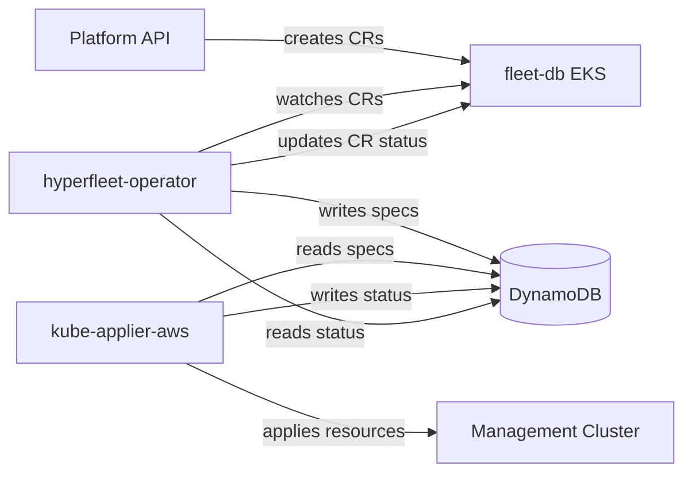
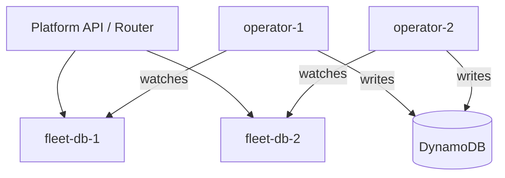

# Hyperfleet Operator Architecture

## Overview

The hyperfleet-operator is a Kubernetes-native cluster lifecycle controller for ROSA HCP. It watches Custom Resources on fleet-db and writes DynamoDB desires that kube-applier-aws applies to management clusters.



## Components

### fleet-db

A workerless EKS cluster whose kube-apiserver serves as a strongly-consistent database. CRDs define the schema, CRs are the rows. The operator and the platform API both connect to fleet-db using EKS Pod Identity (IAM authentication via presigned STS tokens).

### CRDs

All CRDs are **namespace-scoped** under API group `hyperfleet.io/v1alpha1`. The namespace is the customer's AWS account ID (e.g., `123456789012`), providing natural multi-tenancy isolation on fleet-db. The cluster ID is `metadata.name`; in future a regional DynamoDB table will guarantee uniqueness across fleet-db shards.

- **Cluster** — represents a ROSA HCP cluster. Spec contains all the configuration needed to create a HostedCluster on a management cluster (networking, IAM roles, OIDC issuer, etc.).
- **NodePool** — represents a set of worker nodes for a Cluster. References a parent Cluster via `spec.clusterRef`. Must be in the same namespace as its parent Cluster.
- **Placement** — binds a Cluster to a management cluster. Created automatically by the Placement controller. Must be in the same namespace as its Cluster.
- **Manifest** — deploys arbitrary Kubernetes resources to a management cluster. A generic pass-through: raw manifests are written as-is to DynamoDB ApplyDesires. Resources with `watch: true` also get ReadDesires, mirroring their live state from the MC back into the CR status. Used for ZOA (Zero Operator Actions) — deploying Jobs, RBAC, and supporting resources with status feedback — and for any infrastructure resource that doesn't warrant a dedicated controller.

### Controllers

See individual controller docs for detailed creation/deletion flows:

- [Placement Controller](placement-controller.md) — auto-creates Placement for new Clusters
- [Cluster Controller](cluster-controller.md) — generates MC resources, manages lifecycle
- [NodePool Controller](nodepool-controller.md) — generates NodePool resources on MC
- [Manifest Controller](manifest-controller.md) — deploys arbitrary resources to MC

## DynamoDB Desire Pattern

The operator is the **inverse** of kube-applier-aws:

|                         | Specs tables | Status tables |
| ----------------------- | ------------ | ------------- |
| **hyperfleet-operator** | writes       | reads         |
| **kube-applier-aws**    | reads        | writes        |

Per management cluster, there are 6 DynamoDB tables:

- `{mc}-specs-applydesires` / `{mc}-status-applydesires`
- `{mc}-specs-deletedesires` / `{mc}-status-deletedesires`
- `{mc}-specs-readdesires` / `{mc}-status-readdesires`

### Document IDs

Document IDs are deterministic UUID v5 values computed from the resource identity:

```
documentID = UUIDv5(NamespaceUUID, "{taskKey}/{group}/{version}/{resource}/{namespace}/{name}")
```

- **NamespaceUUID**: `a3f1b2c4-d5e6-4f7a-8b9c-0d1e2f3a4b5c` (shared with kube-applier-aws)
- **taskKey**: `hyperfleet-operator` for Cluster/NodePool ApplyDesires, `hyperfleet-operator-read` for ReadDesires, `hyperfleet-operator-delete` for DeleteDesires, `hyperfleet-manifest/{namespace}/{name}` for Manifest (scoped per CR to prevent collisions)

Same inputs always produce the same UUID, giving natural idempotency — re-reconciling a Cluster writes the same document IDs, updating existing rows rather than creating duplicates.

For details on how controllers read, write, and delete specs, see [DynamoDB Read/Write Strategy](dynamodb-strategy.md).

### Management Cluster Registry

The operator reads the list of available management clusters from the ConfigMap `management-clusters` in the `platform-api` namespace on the Regional Cluster. The platform API creates and updates this ConfigMap when registering management clusters. The operator polls it every 5 seconds via the Kubernetes API — this is a temporary data source, so we poll rather than building a full controller with informer watches.

```yaml
# ConfigMap management-clusters (key: clusters.yaml)
- id: mc01
  region: us-east-1
  accountId: "123456789012"
- id: mc02
  region: us-east-1
  accountId: "123456789012"
```

The Placement controller uses this registry to select a management cluster. Currently it picks the first available MC; a placement strategy is planned but not yet implemented.

## Deployment

The operator runs on the Regional Cluster (RC) as a Deployment, deployed via a Helm chart through ArgoCD. It connects to fleet-db via IAM authentication (EKS Pod Identity) and to DynamoDB using the same IAM role.

```
charts/hyperfleet-operator/
├── Chart.yaml
├── values.yaml
├── crds/                    # Auto-synced from config/crd/bases/ by make manifests
└── templates/
    ├── deployment.yaml
    ├── serviceaccount.yaml
    ├── clusterrole.yaml
    └── clusterrolebinding.yaml
```

Required configuration:

- `awsRegion` — AWS region for DynamoDB and EKS DescribeCluster
- `fleetDBClusterName` — EKS cluster name for fleet-db
- `serviceAccount.annotations` — IAM role ARN for Pod Identity
- ConfigMap `management-clusters` in `platform-api` namespace — MC registry (created by the platform API)

## Future Work: Horizontal Scaling via Multiple fleet-db Clusters

The current design uses a single fleet-db EKS cluster as the backing store for all CRs. As the number of managed clusters grows, the kube-apiserver on fleet-db becomes the scaling bottleneck.

The architecture supports a future scale-out model where multiple fleet-db instances exist, each with its own dedicated operator:



In this model:

- Each fleet-db holds a partition of the total cluster population
- Each operator instance watches exactly one fleet-db — no cross-db coordination
- DynamoDB tables remain shared (MC-scoped by table name, not by fleet-db)
- The platform API routes cluster CRUD to the correct fleet-db based on a placement decision
- Fleet-db instances can be independently scaled, upgraded, and failed over

This requires no changes to the operator itself — it already connects to a single fleet-db via configuration. The main work is in the platform API (routing layer) and an assignment mechanism that decides which fleet-db hosts a given cluster.
