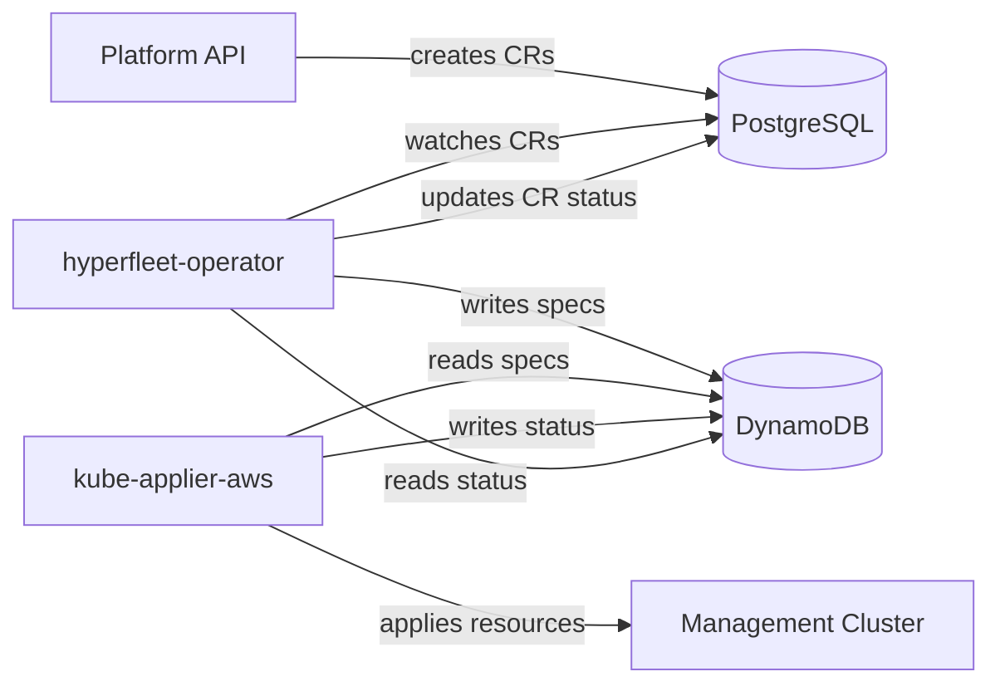

# Hyperfleet Operator Architecture

## Overview

The hyperfleet-operator is a cluster lifecycle controller for ROSA HCP. It watches Custom Resources stored in PostgreSQL (via pgruntime) and writes DynamoDB desires that kube-applier-aws applies to management clusters.



## Components

### PostgreSQL (pgruntime)

The operator uses [postgres-controller-backend](https://github.com/jmelis/postgres-controller-backend) (`pgruntime`) to implement the controller-runtime `client.Client`, `cache.Cache`, and `manager.Manager` interfaces backed by PostgreSQL. This replaces a traditional Kubernetes API server (etcd) with a relational database, providing fenced writes, stored procedures, composite resource versions, and deterministic lease management.

### CRDs

CRDs are under API group `hyperfleet.io/v1alpha1`. Most are **namespace-scoped** — the namespace is the cluster ID, with the account ID stored as a label. **ManagementCluster** is the exception: it is **cluster-scoped** and declared as an `UnshardedGVK` so every operator pod sees all ManagementClusters regardless of its shard assignment.

- **Cluster** — represents a ROSA HCP cluster. Spec contains all the configuration needed to create a HostedCluster on a management cluster (networking, IAM roles, OIDC issuer, etc.).
- **NodePool** — represents a set of worker nodes for a Cluster. References a parent Cluster via `spec.clusterRef`. Must be in the same namespace as its parent Cluster.
- **Placement** — binds a Cluster to a management cluster. Created automatically by the Placement controller. Must be in the same namespace as its Cluster.
- **ManagementCluster** — represents a management cluster in the fleet. Stores region and account metadata.
- **Manifest** — deploys arbitrary Kubernetes resources to a management cluster. A generic pass-through: raw manifests are written as-is to DynamoDB ApplyDesires. Resources with `watch: true` also get ReadDesires, mirroring their live state from the MC back into the CR status. Used for ZOA (Zero Operator Actions) — deploying Jobs, RBAC, and supporting resources with status feedback — and for any infrastructure resource that doesn't warrant a dedicated controller.

### Controllers

See individual controller docs for detailed creation/deletion flows:

- [Placement Controller](placement-controller.md) — auto-creates Placement for new Clusters
- [Cluster Controller](cluster-controller.md) — generates MC resources, manages lifecycle
- [NodePool Controller](nodepool-controller.md) — generates NodePool resources on MC
- [Manifest Controller](manifest-controller.md) — deploys arbitrary resources to MC

## DynamoDB Desire Pattern

The operator is the **inverse** of kube-applier-aws:

|                         | Specs tables | Status tables |
| ----------------------- | ------------ | ------------- |
| **hyperfleet-operator** | writes       | reads         |
| **kube-applier-aws**    | reads        | writes        |

Per management cluster, there are 6 DynamoDB tables:

- `{mc}-specs-applydesires` / `{mc}-status-applydesires`
- `{mc}-specs-deletedesires` / `{mc}-status-deletedesires`
- `{mc}-specs-readdesires` / `{mc}-status-readdesires`

### Document IDs

Document IDs are deterministic UUID v5 values computed from the resource identity:

```
documentID = UUIDv5(NamespaceUUID, "{taskKey}/{group}/{version}/{resource}/{namespace}/{name}")
```

- **NamespaceUUID**: `a3f1b2c4-d5e6-4f7a-8b9c-0d1e2f3a4b5c` (shared with kube-applier-aws)
- **taskKey**: `hyperfleet-operator` for Cluster/NodePool ApplyDesires, `hyperfleet-operator-read` for ReadDesires, `hyperfleet-operator-delete` for DeleteDesires, `hyperfleet-manifest/{namespace}/{name}` for Manifest (scoped per CR to prevent collisions)

Same inputs always produce the same UUID, giving natural idempotency — re-reconciling a Cluster writes the same document IDs, updating existing rows rather than creating duplicates.

For details on how controllers read, write, and delete specs, see [DynamoDB Read/Write Strategy](dynamodb-strategy.md).

### Management Cluster Registry

ManagementCluster CRs in PostgreSQL serve as the registry of available management clusters. The Placement controller reads this registry to select a management cluster for new Clusters.

## Deployment

The operator runs as a StatefulSet, deployed via a Helm chart through ArgoCD. It connects to PostgreSQL for CR storage and to DynamoDB for desire management. The StatefulSet provides stable pod ordinals used for [namespace-hash sharding](sharding.md).

```
charts/hyperfleet-operator/
├── Chart.yaml
├── values.yaml
├── crds/                    # Auto-synced from config/crd/bases/ by make manifests
└── templates/
    ├── statefulset.yaml
    ├── headless-service.yaml
    ├── serviceaccount.yaml
    ├── clusterrole.yaml
    └── clusterrolebinding.yaml
```

Required configuration:

- `awsRegion` — AWS region for DynamoDB
- `baseDomain` — DNS base domain for hosted clusters
- `POSTGRES_DSN` — PostgreSQL connection string

## Horizontal Scaling via Namespace-Hash Sharding

The operator scales horizontally via namespace-hash sharding. The pgruntime cache partitions its List/Watch streams using `abs(hashtext(namespace)::bigint) % replicaCount`, giving cluster-level affinity — all resources for one cluster land in the same shard. Each StatefulSet replica owns a single shard equal to its pod ordinal. See [Sharding](sharding.md) for configuration and scaling details.
