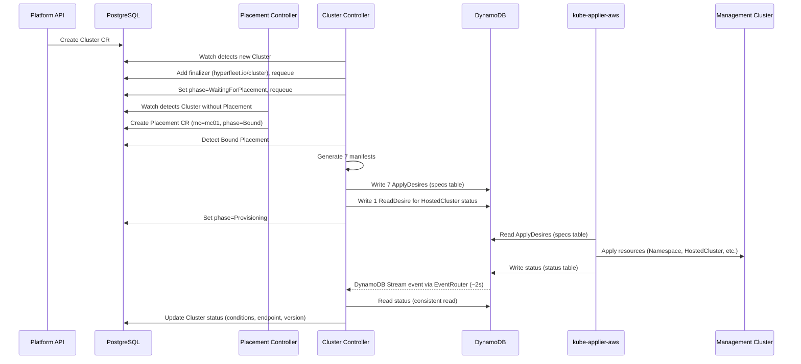
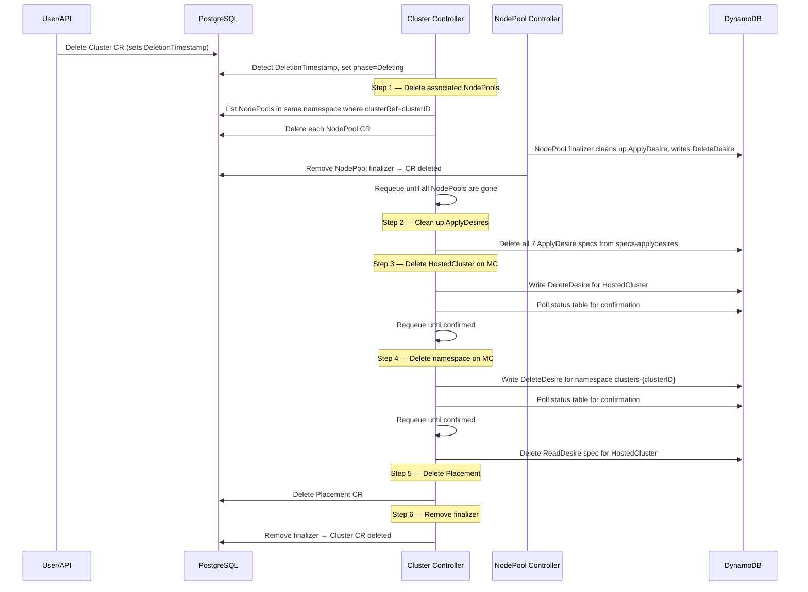

# Cluster Controller

## Naming Convention

The **cluster ID** is `metadata.name` on the Cluster CR. The owning AWS account is `metadata.namespace` (the account ID, e.g., `123456789012`). All related resources (NodePool, Placement) must be in the same namespace as their parent Cluster.

Cluster ID uniqueness is enforced by PostgreSQL's unique constraint on `(gvk, namespace, name)`.

## Creation Flow

### Reconcile Steps

1. **Finalizer**: Adds `hyperfleet.io/cluster` finalizer on first reconcile, requeues
2. **Placement lookup**: Waits for a Bound Placement (created by Placement controller)
3. **Manifest generation**: Generates 7 Kubernetes manifests (see below)
4. **ApplyDesires**: Writes one ApplyDesire per manifest to `{mc}-specs-applydesires`
5. **ReadDesire**: Creates a ReadDesire for the HostedCluster to get status feedback
6. **Status propagation**: Reads status from DynamoDB, propagates conditions/endpoint/version to Cluster CR
7. **Requeue**: Requeues every 5 minutes as a fallback; DynamoDB Streams via EventRouter provides the primary notification path (~2s latency)

### Generated Resources

The controller generates 7 Kubernetes manifests, all scoped to namespace `clusters-{clusterID}`:

| #   | Resource       | Name                   | Purpose                                                       |
| --- | -------------- | ---------------------- | ------------------------------------------------------------- |
| 1   | Namespace      | `clusters-{clusterID}` | Isolation boundary for all cluster resources                  |
| 2   | ConfigMap      | `cluster-config`       | Cluster ID and display name                                   |
| 3   | ConfigMap      | `aws-iam-auth-config`  | AWS IAM authenticator mapping (creator ARN → system:masters)  |
| 4   | ExternalSecret | `pull-secret`          | Pulls container registry credentials from AWS Parameter Store |
| 5   | Certificate    | `api-serving-cert`     | TLS cert for `*.{name}.{hash4}.{baseDomain}` via cert-manager |
| 6   | HostedCluster  | `{clusterName}`        | HyperShift control plane definition                           |
| 7   | Secret         | `ssh-key`              | SSH key placeholder                                           |

### DNS and hash4

The `hash4` value is the first 4 characters of the cluster ID (the CR name). It provides short, collision-resistant subdomains:

- API server: `api.{clusterName}.{hash4}.{baseDomain}`
- OAuth: `oauth.{clusterName}.{hash4}.{baseDomain}`
- TLS SAN: `*.{clusterName}.{hash4}.{baseDomain}`
- HostedCluster baseDomain: `{hash4}.{baseDomain}`

For example, cluster ID `abc12345` with name `my-cluster` and baseDomain `rosa.example.com` produces `api.my-cluster.abc1.rosa.example.com`.

## Deletion Flow

Deletion follows a strict ordering: NodePools first, then HostedCluster (so HyperShift can clean up workers and load balancers), then the namespace (cascading remaining resources). ApplyDesire specs are always removed before DeleteDesires are written to prevent kube-applier from racing and re-applying resources being deleted.

### Deletion Steps

1. **NodePool cascade**: Lists all NodePools in the same namespace with matching `clusterRef`, deletes each one. Each NodePool has its own finalizer that cleans up its ApplyDesire and writes a DeleteDesire before clearing. Requeues until all NodePools are fully gone.
2. **ApplyDesire cleanup**: Deletes all 7 ApplyDesire specs from DynamoDB. This must happen before writing DeleteDesires to prevent kube-applier from racing and re-applying resources that are being deleted.
3. **HostedCluster DeleteDesire**: Writes a DeleteDesire for the HostedCluster resource and waits for confirmation. Deleting the HostedCluster first allows HyperShift to clean up worker nodes and load balancers before the namespace is removed.
4. **Namespace DeleteDesire**: Writes a DeleteDesire for `clusters-{clusterID}`, cascading all remaining MC resources. After confirmation, deletes the HostedCluster ReadDesire spec from DynamoDB.
5. **Placement cleanup**: Deletes the Placement CR (last, after MC resources are confirmed gone).
6. **Finalizer removal**: Removes the `hyperfleet.io/cluster` finalizer, allowing Kubernetes to complete the CR deletion.
