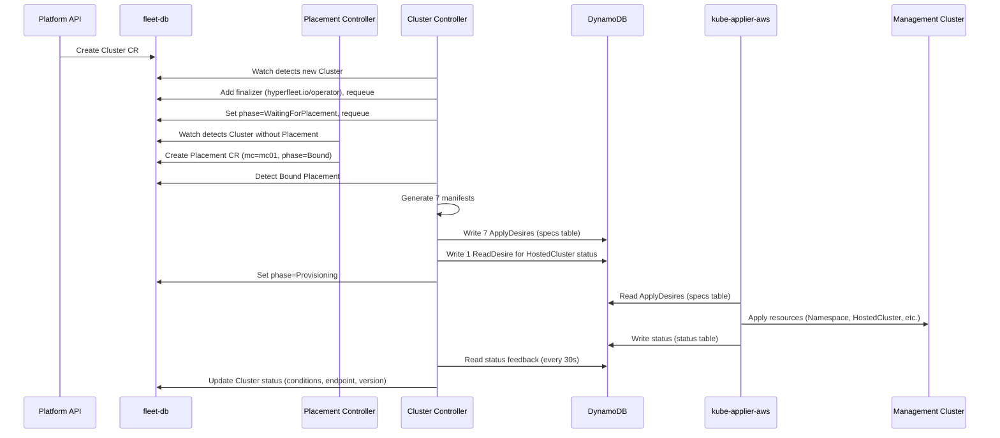
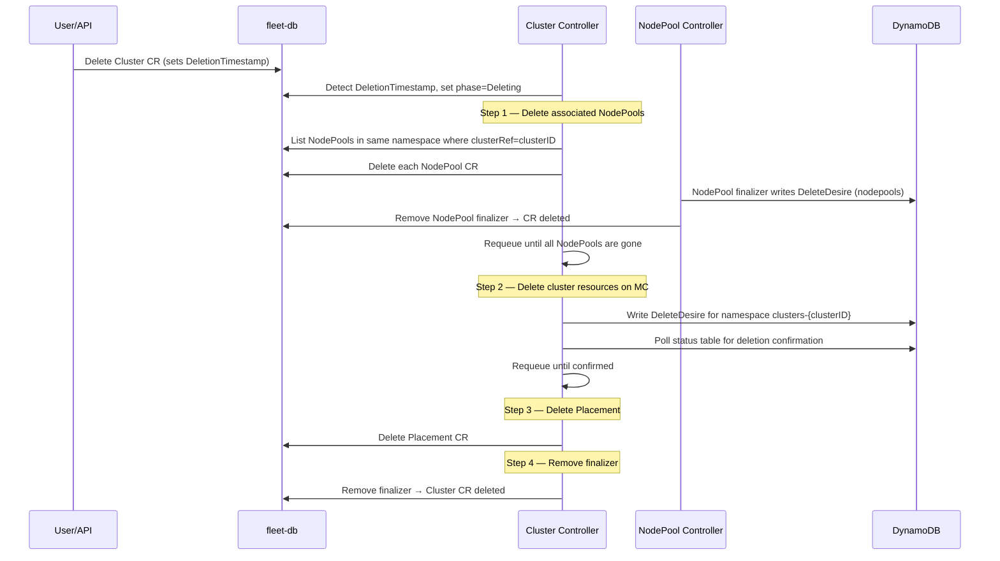

# Cluster Controller

## Naming Convention

The **cluster ID** is `metadata.name` on the Cluster CR. The owning AWS account is `metadata.namespace` (the account ID, e.g., `123456789012`). All related resources (NodePool, Placement) must be in the same namespace as their parent Cluster.

In future, a regional DynamoDB table will guarantee cluster ID uniqueness across fleet-db shards. For now, with a single fleet-db instance, uniqueness is enforced by the kube-apiserver.

## Creation Flow

### Reconcile Steps

1. **Finalizer**: Adds `hyperfleet.io/operator` finalizer on first reconcile, requeues
2. **Placement lookup**: Waits for a Bound Placement (created by Placement controller)
3. **Manifest generation**: Generates 7 Kubernetes manifests (see below)
4. **ApplyDesires**: Writes one ApplyDesire per manifest to `{mc}-specs-applydesires`
5. **ReadDesire**: Creates a ReadDesire for the HostedCluster to get status feedback
6. **Status propagation**: Reads status from DynamoDB, propagates conditions/endpoint/version to Cluster CR
7. **Requeue**: Requeues every 30s for status refresh

### Generated Resources

The controller generates 7 Kubernetes manifests, all scoped to namespace `clusters-{clusterID}`:

| # | Resource | Name | Purpose |
| --- | --- | --- | --- |
| 1 | Namespace | `clusters-{clusterID}` | Isolation boundary for all cluster resources |
| 2 | ConfigMap | `cluster-config` | Cluster ID and display name |
| 3 | ConfigMap | `aws-iam-auth-config` | AWS IAM authenticator mapping (creator ARN → system:masters) |
| 4 | ExternalSecret | `pull-secret` | Pulls container registry credentials from AWS Parameter Store |
| 5 | Certificate | `api-serving-cert` | TLS cert for `*.{name}.{hash4}.{baseDomain}` via cert-manager |
| 6 | HostedCluster | `{clusterName}` | HyperShift control plane definition |
| 7 | Secret | `ssh-key` | SSH key placeholder |

### DNS and hash4

The `hash4` value is the first 4 characters of the cluster ID (the CR name). It provides short, collision-resistant subdomains:

- API server: `api.{clusterName}.{hash4}.{baseDomain}`
- OAuth: `oauth.{clusterName}.{hash4}.{baseDomain}`
- TLS SAN: `*.{clusterName}.{hash4}.{baseDomain}`
- HostedCluster baseDomain: `{hash4}.{baseDomain}`

For example, cluster ID `abc12345` with name `my-cluster` and baseDomain `rosa.example.com` produces `api.my-cluster.abc1.rosa.example.com`.

## Deletion Flow

Deletion follows a strict ordering to ensure MC resources are cleaned up before the Placement is removed. The controller requeues at each step, making the flow non-blocking.

### Deletion Steps

1. **NodePool cascade**: Lists all NodePools in the same namespace with matching `clusterRef`, deletes each one. Each NodePool has its own finalizer that writes a DeleteDesire before clearing. The controller requeues until all NodePools are fully gone.
2. **Namespace DeleteDesire**: Writes a DeleteDesire for the `clusters-{clusterID}` namespace, which cascades deletion of all MC resources. Polls the `{mc}-status-deletedesires` table until kube-applier-aws confirms the deletion.
3. **Placement cleanup**: Deletes the Placement CR (last, after MC resources are confirmed gone).
4. **Finalizer removal**: Removes the `hyperfleet.io/operator` finalizer, allowing Kubernetes to complete the CR deletion.
