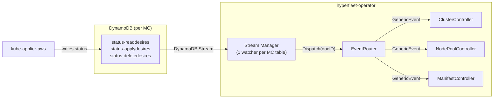

# DynamoDB Status Distribution

How DynamoDB status updates reach the right controller.

## Overview



## Event flow

1. **kube-applier-aws** applies/deletes/reads resources on a management cluster and writes the result to the MC's DynamoDB status tables.

2. **Stream Manager** runs one `Watcher` goroutine per MC per status table suffix. Each watcher tails the DynamoDB Stream (poll every 2s), extracts the `documentID` from each INSERT/MODIFY event, and calls `EventRouter.Dispatch(docID)`.

3. **EventRouter** is a shared in-memory index mapping `documentID → {channel, CR key}`. On dispatch, it looks up the document ID and sends a `GenericEvent` into the target controller's `StatusEvents` channel (non-blocking — drops if full).

4. **Controller** receives the `GenericEvent` via `WatchesRawSource(source.Channel(...))` in `SetupWithManager`, which enqueues a reconcile for the CR. The reconcile calls `GetDesireStatus` to read the current status from DynamoDB with a consistent read.

## Registration

Controllers register their document IDs with the EventRouter during reconciliation, after upserting desires:

```go
r.EventRouter.Register(docID, EventTarget{
    Channel: r.StatusEvents,
    Key:     req.NamespacedName,
})
```

On deletion, controllers deregister to stop receiving events:

```go
r.EventRouter.Deregister(docID)
```

Each controller type has its own `StatusEvents` channel (buffered, capacity 256). All controllers share one `EventRouter` instance.

## Replica limit

The operator is currently limited to **2 replicas** due to DynamoDB Streams constraints. Each stream shard can only be read by a limited number of consumers, and the stream watcher runs on every replica — scaling beyond 2 replicas risks throttling or missed events on the stream path.

## Fallback polling

Stream events can be lost (shard rotation, throttling). Every successful reconcile returns `RequeueAfter: 5m` as a fallback — if no stream event arrives, the controller re-reconciles and reads status directly. Active waiting states (no placement yet, delete pending) use `RequeueAfter: 5s`.

## Writing and reading specs

Use `UpsertApplyDesire`, `UpsertDeleteDesire`, or `UpsertReadDesire` to write specs. The DynamoDB client keeps an in-memory hash cache per desire — if the spec hasn't changed, the write is skipped entirely (no DynamoDB call). Use `DeleteDesireSpec` to remove a spec row (always remove ApplyDesires before writing DeleteDesires).

Use `GetApplyDesireStatus` / `GetDeleteDesireStatus` / `GetReadDesireStatus` for consistent reads. Use `CheckApplyDesireStatuses` / `CheckDeleteDesireStatuses` to check whether kube-applier has processed your specs — these compare `ObservedDesireUpdateTime` against the spec's `updateTime` to ignore stale statuses.
