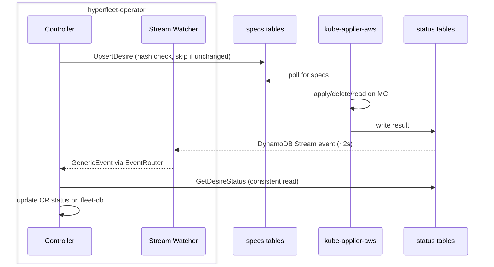

# DynamoDB Read/Write Strategy

How controllers interact with DynamoDB. Follow these patterns when writing a new controller.

## Writing specs

Use `UpsertApplyDesire`, `UpsertDeleteDesire`, or `UpsertReadDesire`. All three hash the spec and skip the write if unchanged, preserving the existing `updateTime`. Always use `UpsertResult.UpdateTime` when building `DesireStatusEntry`, since staleness gating compares it against the status timestamp.

## Reading status

Use `GetApplyDesireStatus`, `GetDeleteDesireStatus`, or `GetReadDesireStatus`. These do strongly consistent reads.

Use `CheckApplyDesireStatuses` or `CheckDeleteDesireStatuses` to check whether kube-applier has processed your specs. These compare `ObservedDesireUpdateTime` against the spec's `updateTime` to ignore stale statuses.

## Removing specs

Use `DeleteDesireSpec` to remove a spec row. Always remove ApplyDesire specs before writing DeleteDesires, otherwise kube-applier may re-apply a resource you're trying to delete.

## Receiving status updates

Register your document IDs with the `EventRouter` during reconciliation. The stream watcher picks up status changes and sends a `GenericEvent` to your controller's `StatusEvents` channel, triggering a reconcile. See existing controllers' `SetupWithManager` for how to wire this up.

Set a `RequeueAfter` as a fallback in case stream events are missed.
