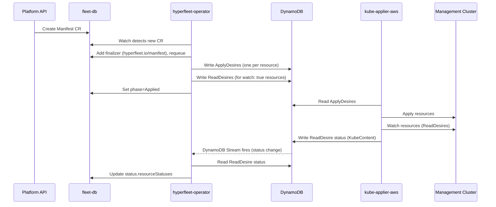
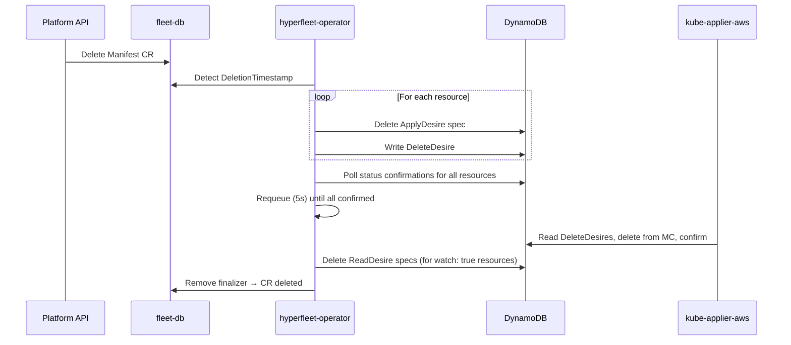

# Manifest Controller

Deploys arbitrary Kubernetes resources to a management cluster as a pass-through — raw manifests are written as-is to DynamoDB ApplyDesires. Resources with `watch: true` also get ReadDesires, mirroring their live state from the MC back into CR status. Unlike Cluster/NodePool controllers, no manifest generation happens; the content is user-supplied.

Used for ZOA (deploying Jobs + RBAC with status feedback) and infrastructure resources (monitoring, CRDs, shared configs).

## Creation Flow



### Reconcile Steps

1. **Finalizer**: Adds `hyperfleet.io/manifest` finalizer on first reconcile, requeues
2. **ApplyDesires**: Writes one ApplyDesire per resource in `spec.resources`
3. **ReadDesires**: For resources with `watch: true`, writes a ReadDesire. kube-applier-aws mirrors the resource's live state back to DynamoDB as raw `KubeContent`
4. **Status feedback**: The `status-readdesires` DynamoDB table has DynamoDB Streams enabled. When kube-applier-aws writes status, the stream triggers reconciliation within ~2 seconds. The operator reads the ReadDesire status and surfaces raw `KubeContent` in `status.resourceStatuses`. A fallback requeue at 5-minute intervals covers edge cases (operator restart, missed stream events). The operator does not parse the content — consumers extract the fields they need from the mirrored resource
5. **Requeue**: Requeues every 5 minutes as a fallback if watched resources exist; DynamoDB Streams provides the primary notification path

## Deletion Flow



### Deletion Steps

1. **Clean up and delete**: For each resource, removes the ApplyDesire spec then writes a DeleteDesire. ApplyDesires are removed first to prevent kube-applier from racing and re-applying resources being deleted.
2. **Check confirmations**: Polls `{mc}-status-deletedesires` for every resource. Requeues at 5s until all are confirmed
3. **ReadDesire cleanup**: Deletes ReadDesire specs from DynamoDB for any resources that had `watch: true`
4. **Finalizer removal**: Removes finalizer, allowing Kubernetes to complete CR deletion

## CRD Example (ZOA Trusted Action)

```yaml
apiVersion: hyperfleet.io/v1alpha1
kind: Manifest
metadata:
  name: zoa-collect-logs-abc123
  namespace: "123456789012"
spec:
  managementCluster: mc01
  resources:
    - resource: serviceaccounts
      content:
        apiVersion: v1
        kind: ServiceAccount
        metadata:
          name: zoa-runner
          namespace: zoa-actions
    - resource: roles
      content:
        apiVersion: rbac.authorization.k8s.io/v1
        kind: Role
        metadata:
          name: zoa-runner
          namespace: zoa-actions
        rules:
          - apiGroups: [""]
            resources: ["pods/log"]
            verbs: ["get"]
    - resource: rolebindings
      content:
        apiVersion: rbac.authorization.k8s.io/v1
        kind: RoleBinding
        metadata:
          name: zoa-runner
          namespace: zoa-actions
        roleRef:
          apiGroup: rbac.authorization.k8s.io
          kind: Role
          name: zoa-runner
        subjects:
          - kind: ServiceAccount
            name: zoa-runner
            namespace: zoa-actions
    - resource: jobs
      watch: true
      content:
        apiVersion: batch/v1
        kind: Job
        metadata:
          name: collect-logs-abc123
          namespace: zoa-actions
        spec:
          template:
            spec:
              serviceAccountName: zoa-runner
              containers:
                - name: runner
                  image: registry.example.com/zoa-runner:latest
              restartPolicy: Never
```

### ResourceTemplate Fields

| Field      | Required | Description                                                                  |
| ---------- | -------- | ---------------------------------------------------------------------------- |
| `resource` | Yes      | Plural Kubernetes resource name (e.g. `jobs`, `configmaps`)                  |
| `content`  | Yes      | Full Kubernetes manifest. Must include `apiVersion`, `kind`, `metadata.name` |
| `watch`    | No       | Creates a ReadDesire, mirroring live state into `status.resourceStatuses`    |

## Document ID Scoping

Each CR uses a scoped taskKey: `hyperfleet-manifest/{namespace}/{name}`. This prevents collisions between two Manifest CRs deploying the same resource and between Manifest and Cluster/NodePool controllers (which use `hyperfleet-operator`).

## Status

```yaml
status:
  phase: Applied
  appliedResources: 4
  resourceStatuses:
    - resource: jobs
      name: collect-logs-abc123
      namespace: zoa-actions
      status:
        succeeded: 1
        completionTime: "2026-06-25T10:00:05Z"
```

- `phase: Applied` — ApplyDesires written to DynamoDB, not confirmed on MC
- `resourceStatuses` — mirrored `.status` sub-object for `watch: true` resources. Only the status is stored, not the full object, to avoid duplicating spec content in etcd. Empty until kube-applier-aws applies and mirrors back

## DynamoDB Streams Integration

The operator consumes DynamoDB Streams on both the `status-applydesires` and `status-readdesires` tables to react to status changes within ~2 seconds instead of polling. A `statusstream.Manager` runs one stream watcher per management cluster per table suffix, mapping changed `documentID`s back to the owning CR via a shared `EventRouter`. A 5-minute fallback requeue covers operator restarts and missed events.

## Known Limitations

- **Orphan cleanup is best-effort**: When resources are removed from `spec.resources`, the controller deletes the old ApplyDesire specs from DynamoDB on the next reconcile (using `status.resourceStatuses` to track previously-applied resources). This does not write DeleteDesires — the resource remains on the MC until the CR is deleted or the resource is removed by other means.
- **No drift detection**: Writes ApplyDesires on each reconcile but does not verify MC state matches.
- **No multi-MC fan-out**: Each CR targets one MC. Create one per MC for multi-MC deployments.
- **No admission-time validation**: Malformed `content` (missing `apiVersion` or `metadata.name`) errors at reconcile time, not admission.
