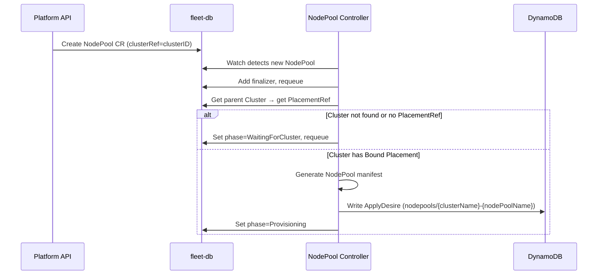
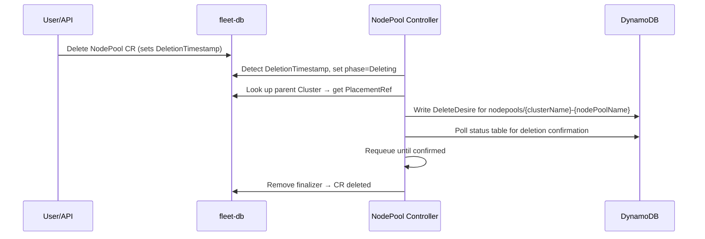

# NodePool Controller

## Creation Flow

### Reconcile Steps

1. **Finalizer**: Adds `hyperfleet.io/operator` finalizer on first reconcile, requeues
2. **Parent Cluster lookup**: Gets Cluster CR by `spec.clusterRef` in the same namespace (account ID), waits if not found or no `PlacementRef`
3. **Manifest generation**: Generates a HyperShift NodePool manifest
4. **ApplyDesire**: Writes one ApplyDesire to `{mc}-specs-applydesires`
5. **Status propagation**: Reads status from DynamoDB, updates NodePool CR conditions
6. **Requeue**: Requeues every 30s for status refresh

### Generated Resource

The NodePool manifest name on the MC is `{clusterName}-{nodePoolName}` and lives in namespace `clusters-{clusterID}`.

| Resource | Name | Purpose |
| --- | --- | --- |
| NodePool (HyperShift) | `{clusterName}-{nodePoolName}` | Worker node set on the management cluster |

## Deletion Flow

When a NodePool is deleted (either standalone or as part of Cluster cascade deletion):

### Deletion Steps

1. **PlacementRef lookup**: Gets the parent Cluster's PlacementRef to determine the target MC
2. **DeleteDesire**: Writes a DeleteDesire for the NodePool resource on the MC
3. **Confirmation**: Polls `{mc}-status-deletedesires` until kube-applier-aws confirms the deletion
4. **Finalizer removal**: Removes finalizer, allowing the CR to be garbage-collected

The parent Cluster and Placement are unaffected by standalone NodePool deletion.

## Conditions

| Type | Status | Reason | Description |
| --- | --- | --- | --- |
| `Applied` | `True` | `DesireApplied` | kube-applier-aws has confirmed the NodePool manifest was applied to the management cluster |

The `Applied` condition is set when the DynamoDB status feedback shows `AppliedResourceGeneration > 0`, indicating kube-applier-aws has successfully applied the NodePool to the MC.
