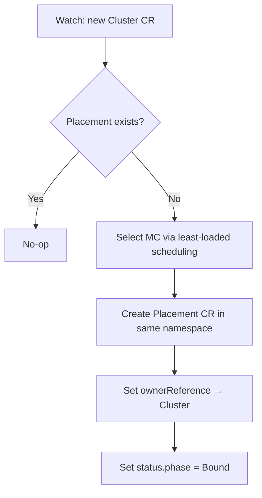

# Placement Controller

## Purpose

Watches Cluster CRs. When a new Cluster appears without a Placement, creates one by selecting a management cluster using least-loaded scheduling. Sets owner reference so the Placement is garbage-collected with its Cluster.

## MC Selection

The controller reads the available management clusters from a ConfigMap mounted as `/etc/hyperfleet/clusters.yaml` (see [Architecture — MC Registry](architecture.md#management-cluster-registry)). When multiple MCs are available, it lists all existing Placements across all namespaces, counts how many are assigned to each MC, and picks the one with the fewest. With a single MC, it is assigned directly.

## Reconcile Flow

## Notes

- Cluster and Placement are namespace-scoped under the customer's AWS account ID. The Placement is created in the same namespace as the Cluster.
- Owner references ensure Placements are garbage-collected when the Cluster CR is deleted.
- The MC ConfigMap is managed by the platform API when registering management clusters. The operator polls the mounted file every 5 seconds and reloads automatically when changes are detected. This is a temporary mechanism; the long-term plan is a regional DynamoDB table for MC registration.
