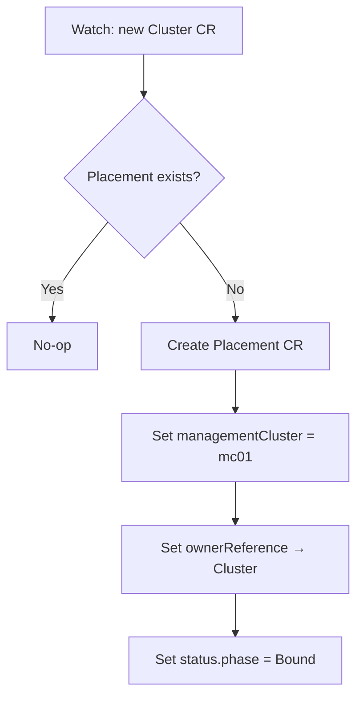

# Placement Controller

## Purpose

Watches Cluster CRs. When a new Cluster appears without a Placement, creates one with `managementCluster: "mc01"` (hardcoded for now). Sets owner reference so the Placement is garbage-collected with its Cluster.

## Reconcile Flow

## Notes

- The Placement controller is intentionally simple — it always assigns `mc01`. Future work will add scheduling logic based on MC capacity, region topology, and customer constraints.
- Owner references ensure Placements are garbage-collected when the Cluster CR is deleted.
