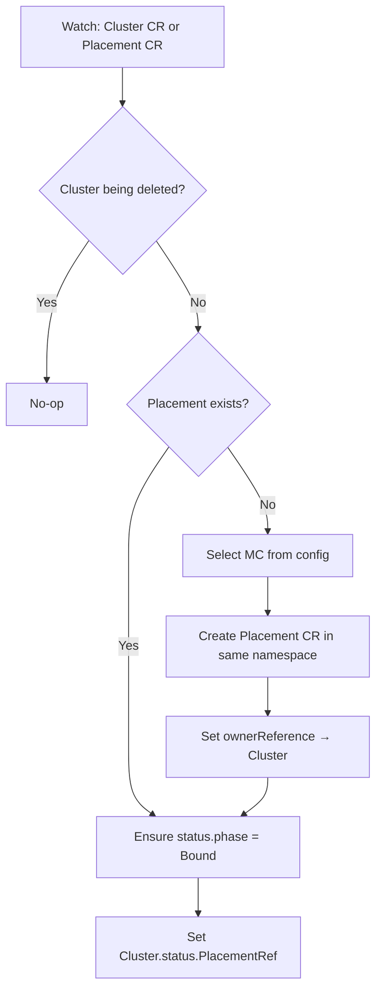

# Placement Controller

## Purpose

Watches Cluster CRs. When a new Cluster appears without a Placement, creates one by selecting a management cluster. Sets owner reference so the Placement is garbage-collected with its Cluster. Skips Clusters that are being deleted.

## MC Selection

The controller reads the available management clusters from the ConfigMap `management-clusters` in the `platform-api` namespace on the Regional Cluster (see [Architecture — MC Registry](architecture.md#management-cluster-registry)). Currently, it picks the first available MC from the list. A placement strategy is planned but not yet implemented — see the `TODO` in `selectManagementCluster`.

## Reconcile Flow

## Watches

The controller watches two resource types:

- **Cluster CRs** — primary watch, reconciles when a Cluster is created or updated
- **Placement CRs** — secondary watch via `handler.EnqueueRequestsFromMapFunc`, which maps a Placement back to its parent Cluster via `spec.clusterRef` and triggers reconciliation

## Notes

- Cluster and Placement are namespace-scoped under the customer's AWS account ID. The Placement is created in the same namespace as the Cluster.
- Owner references ensure Placements are garbage-collected when the Cluster CR is deleted. The Cluster controller also explicitly deletes the Placement during its deletion flow as a safety measure.
- The MC ConfigMap `management-clusters` in the `platform-api` namespace is managed by the platform API when registering management clusters. The operator polls it every 5 seconds via the Kubernetes API. This is a temporary data source, so we poll rather than building a full controller with informer watches.
